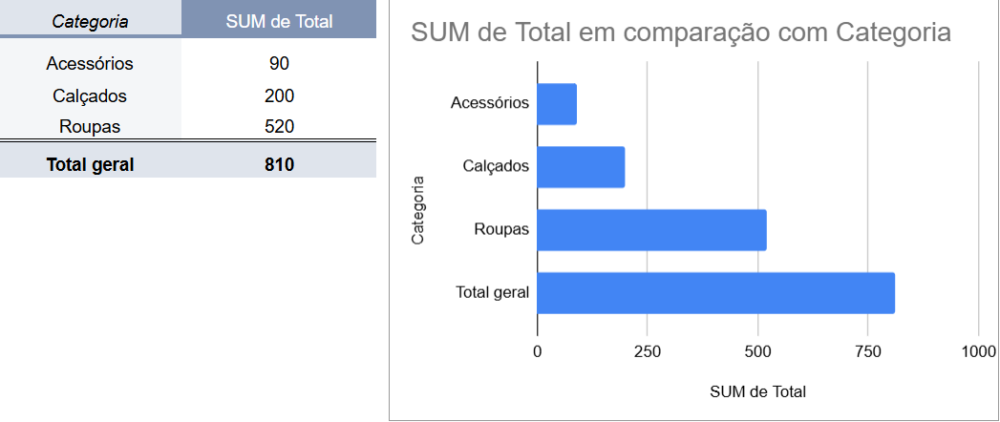

# 📊 Dashboard de Vendas

## 📌 Sobre o projeto
Este projeto tem como objetivo analisar dados de vendas utilizando Excel/Google Sheets.

## 🎯 Objetivo
Criar um dashboard simples para visualizar informações importantes sobre vendas.

## 📊 Análises realizadas
- Total de vendas por categoria
- Produto mais vendido
- Participação por categoria

## 🛠️ Ferramentas
- Excel / Google Sheets

## 📸 Dashboard

## 🚀 Aprendizados
- Tabela dinâmica
- Criação de gráficos
- Organização de dashboard
